# Bitsy Games Data Set
This data set combines around 447 [Bitsy](http://ledoux.io/bitsy/editor.html) games that was collected By [Mark Wonnacott](https://candle.itch.io/) in a numpy easy to parse format.

# Different Types of files
- [animation.npz](https://github.com/amidos2006/BitsyDo/blob/master/DataSet/animation.npz): contains all game sprites, items, tiles, and avatar frames.
- [text.npz](https://github.com/amidos2006/BitsyDo/blob/master/DataSet/text.npz): contains all the game text: game names, sprite dialogues, item dialogues, and game endings.
- [images.npz](https://github.com/amidos2006/BitsyDo/blob/master/DataSet/images.npz): contains all the game graphics: avatars, sprites, solid tiles, background tiles, and items.
- [palettes.npz](https://github.com/amidos2006/BitsyDo/blob/master/DataSet/palettes.npz): contains all the palletes used in all the included games.
- [rooms.npz](https://github.com/amidos2006/BitsyDo/blob/master/DataSet/rooms.npz): contains all the game rooms in a generic format that is composed of 3 layers: solid and background tile layer; sprites and items tile layer; and exit and endings tile layer. This data is divided into two types: starting rooms and other rooms.
- [full.npz](https://github.com/amidos2006/BitsyDo/blob/master/DataSet/full.npz): contains all the game files as pure text files. It is not a big data set for now (447 games) so be careful not to overfit the data.

# How to use the Data Set
Loading the data set is super simple using numpy in Python. The following code will load any file in its format
```python
import numpy as np

data = np.load(file_name)
```
Each file returns python object that you need to access using the correct keys to retrive the numpy arrays of the data.
### animation.npz
The animation object contains two numpy array of the same length (15414 entries):
- "frame1" (15414 entries): the first frame of the animation
- "frame2" (15414 entries): the second frame of the animation
Each entry from either "frame1" or "frame2" is an 8x8 binary image.

Here are some examples of the animations:
<table align="center">
    <tr>
        <td>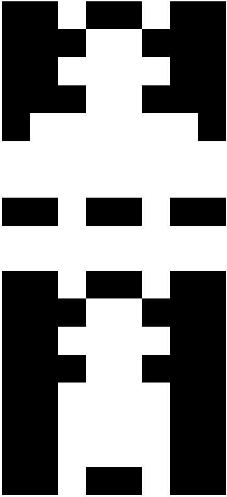</td>
        <td></td>
        <td>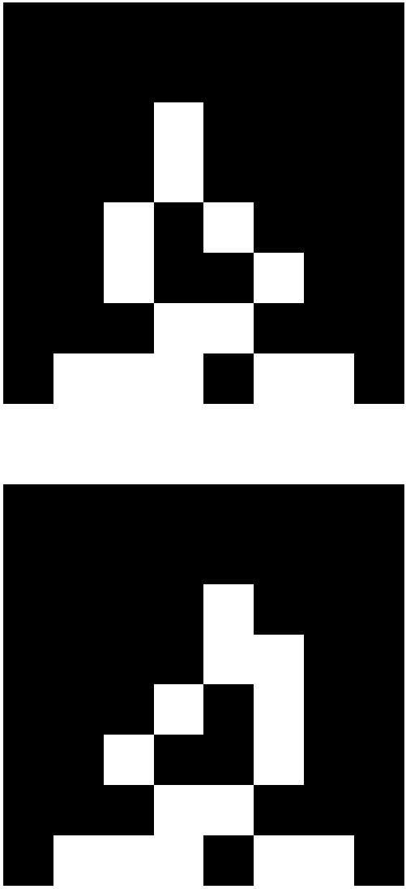</td>
        <td>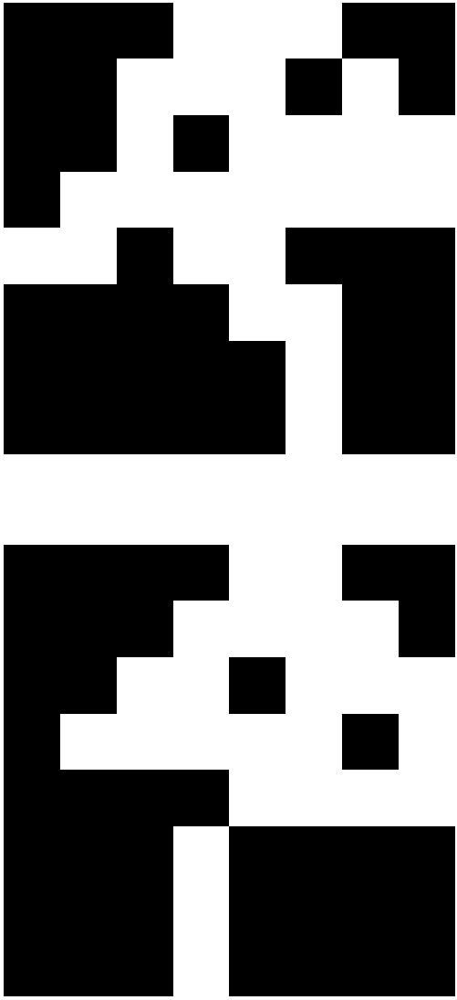</td>
        <td>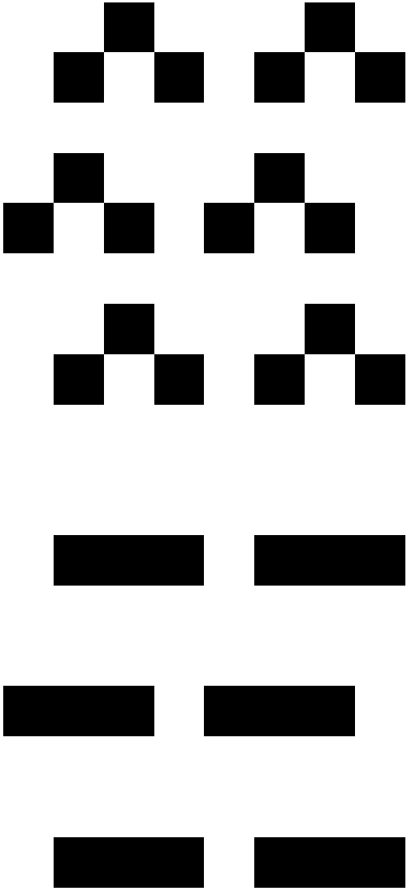</td>
    </tr>
</table>

### text.npz
The text object contains all the game text in four numpy arrays of various length:
- "games" (447 entries): contains all the game names that's why the number of entries is equal to the number of games.
- "sprites" (6248 entries): contains all the dialogues that appear when talking to game sprites.
- "items" (2256 entries): contains all the dialogues that appear when collecting an item.
- "endings" (512 entries): contains all the game ending text. The number of endings is slightly greater than number of games which signify that some games have multiple endings.
Each entry is a string that represents game name/sprite dialogue/item dialogue/ending text.

Here are some examples of the text:
<table align="center">
    <tr>
        <th>Game Name</th>
        <th>Sprite Dialogue</th>
        <th>Item Dialogue</th>
        <th>Ending Text</th>
    </tr>
    <tr>
        <td>I am lost on this planet. Alone, yet crowded by thoughts</td>
        <td>C'est le lit de tes parents.</td>
        <td>Reinhardt's hat. The unthinkable has clearly occurred. The ice has broken and Reinhardt lies among a tangle of metal and ice.</td>
        <td>oh hey what if i did something for that tipsy jam though???</td>
    </tr>
    <tr>
        <td>Peter Februar Games presents: {clr2}Indoor Cat{clr2}</td>
        <td>Audrey: I learned this dance from a Youtube video.</td>
        <td>o{wvy}{clr2}{clr2}{wvy}</td>
        <td>Clicking the STOP & EJECT button {shk}flips you{shk} right out of the game!</td>
    </tr>
    <tr>
        <td>{clr1}MY HOUSE{clr1}</td>
        <td>huh.. the chief has a really nice desk..</td>
        <td>We had found the cartridge at a yard sale</td>
        <td>*knock knock*</td>
    </tr>
</table>

### images.npz
The images object contains five different numpy array that represent all the game graphics:
- "avatar" (447 entries): this numpy array contain all the graphics to all the avatars for the 447 games.
- "sprites" (14002 entries): this numpy array contains graphics for the game sprites that the player can interact inside the game.
- "items" (4164 entries): this numpy array contains graphics for all the game items that the player can collect inside the game.
- "walls" (13843 entries): this numpy array contains graphics to all the game tiles that are walls which means the avatar can't move over them.
- "background" (59324 entries): this numpy array contains the graphics to all the game tiles that are used as scenery or background as they don't collide with the player.
All the images are 8x8 binary images.

Here are some examples:
<table align="center">
    <tr>
        <th>Avatar</th>
        <th>Sprite</th>
        <th>Item</th>
        <th>Wall</th>
        <th>Background</th>
    </tr>
    <tr>
        <td>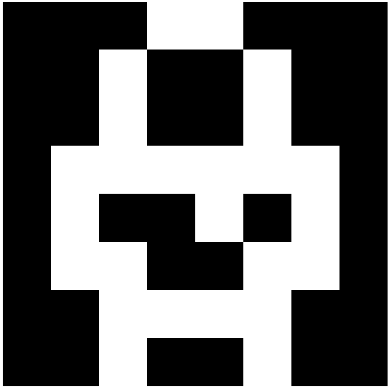</td>
        <td>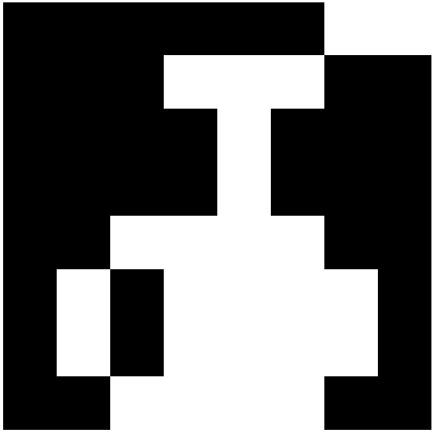</td>
        <td></td>
        <td>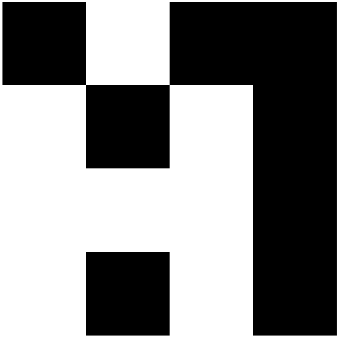</td>
        <td>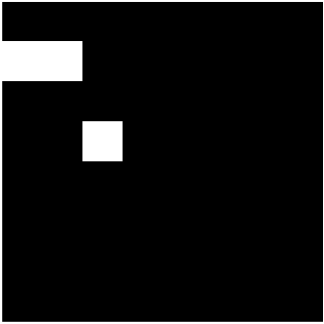</td>
    </tr>
    <tr>
        <td>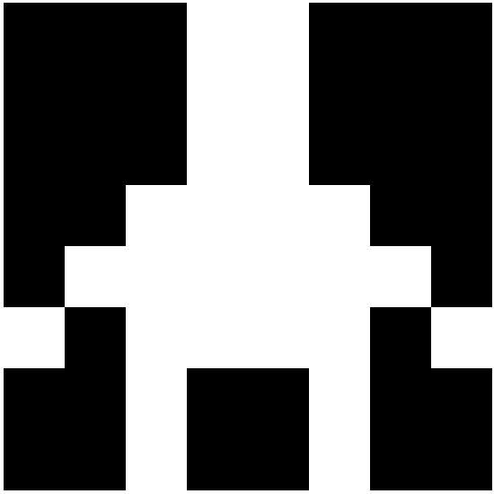</td>
        <td>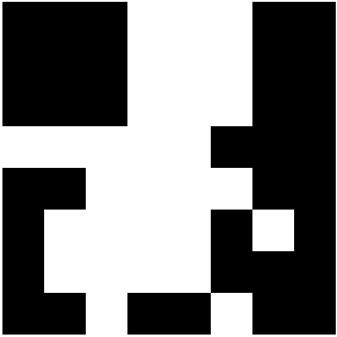</td>
        <td></td>
        <td></td>
        <td>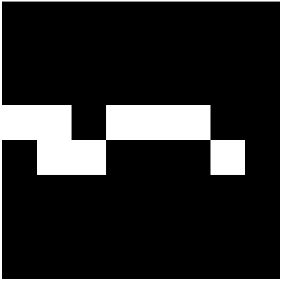</td>
    </tr>
    <tr>
        <td></td>
        <td>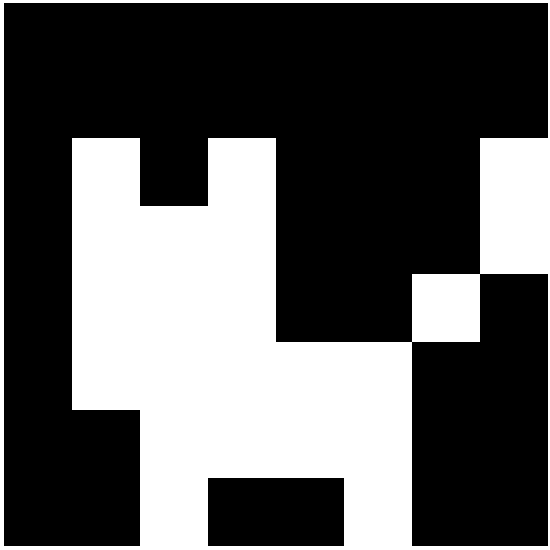</td>
        <td>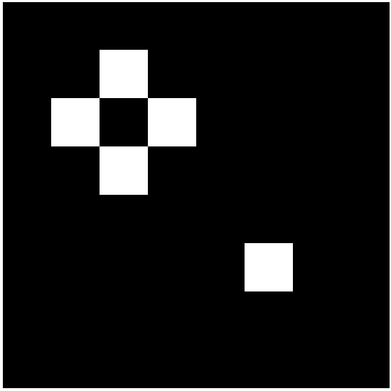</td>
        <td>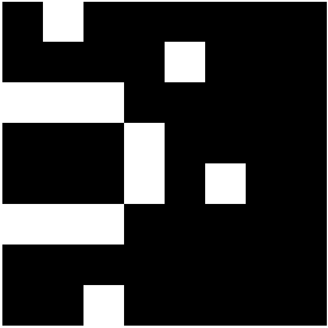</td>
        <td>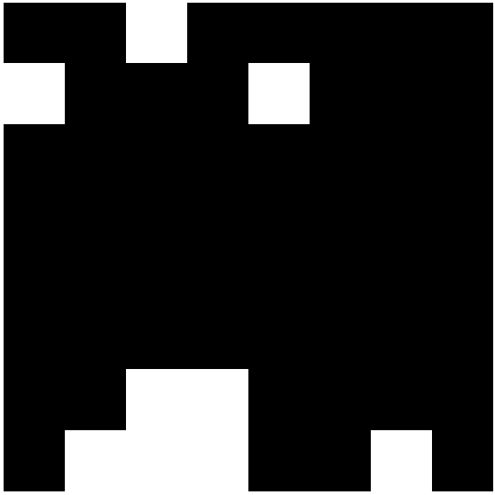</td>
    </tr>
    <tr>
        <td>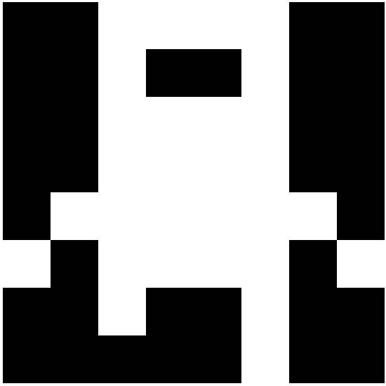</td>
        <td></td>
        <td>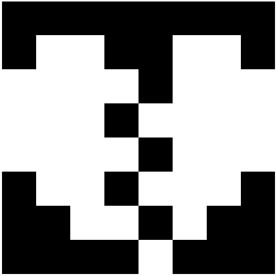</td>
        <td>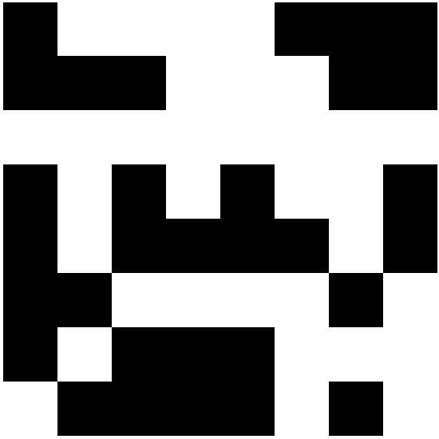</td>
        <td>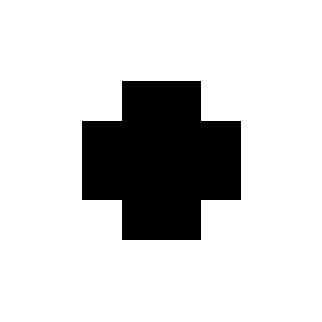</td>
    </tr>
    <tr>
        <td></td>
        <td></td>
        <td></td>
        <td>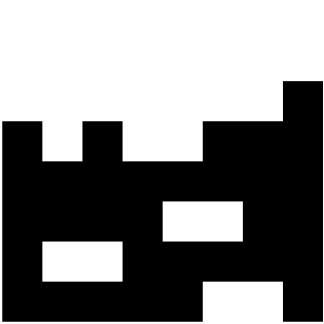</td>
        <td>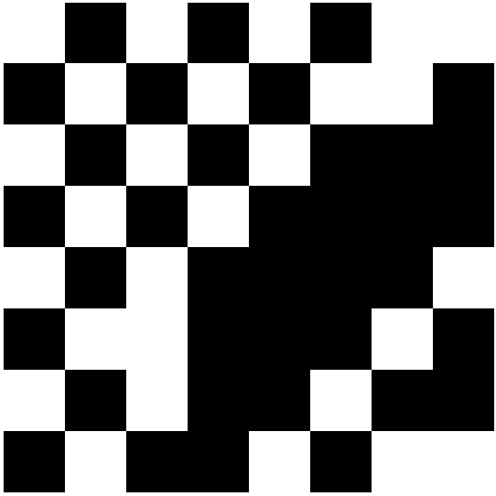</td>
    </tr>
</table>

### palettes.npz
The palettes object contains one numpy array where it represent the 3 colors used for the palette (1579 entries):
- "data" (1579 entries): Each entry is 9 integers (values between 0 and 255) where each three represent a color of the palette in order (background color then tile color followed by sprite color).

Here are some examples of the palettes:
<table align="center">
    <tr>
        <td></td>
        <td></td>
        <td></td>
        <td></td>
        <td></td>
    </tr>
</table>

### rooms.npz
The rooms object contains two numpy array. One for the starting rooms (rooms where the avatar starts) and the other for the rest of rooms:
- "start" (447 entries):
- "other" (7305 entries):

Each room is 16x16x3 where each channel represents different layer of objects:
- channel 0: represent all the game tiles. Each entry can have value of 0 (empty), 1 (background tile), and 2 (solid tile).
- channel 1: represents all the game sprites/items/avatar. Each entry can have value 0 (empty), 1 (avatar), 2 (sprite), and 3 (item).
- channel 2: represents all the game exits/endings locations. Each entry can have value 0 (empty), 1 (exit), 2 (entrance), 3 (exit and entrance), and 4 (ending).

Here are some examples of rooms:
<table align="center">
    <tr>
        <td>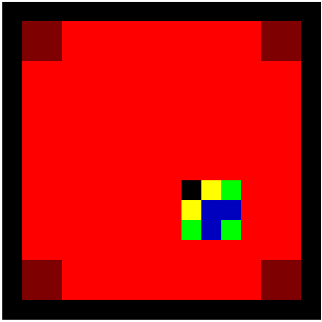</td>
        <td>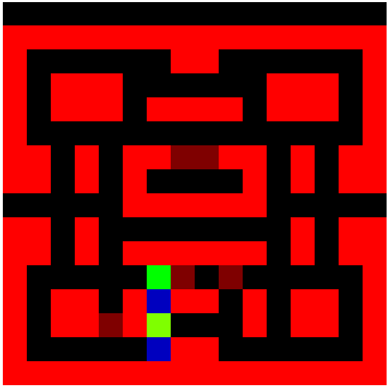</td>
        <td>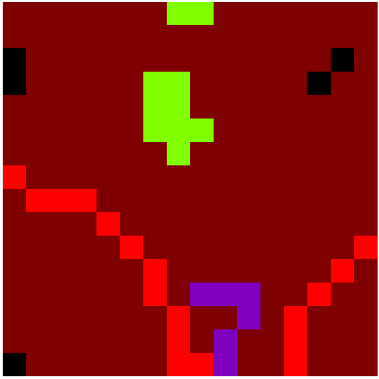</td>
        <td>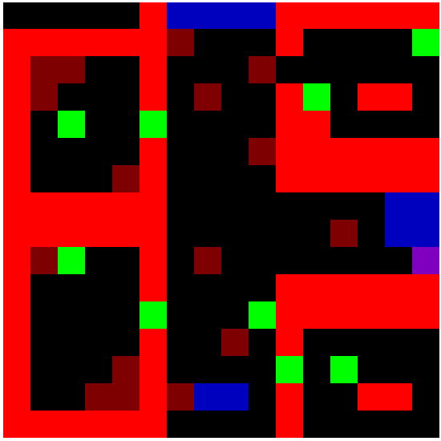</td>
        <td>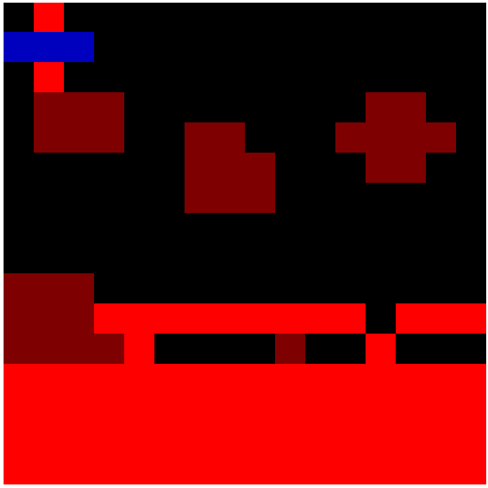</td>
    </tr>
</table>

### full.npz
The full object contain one numpy array where each entry represent the text of a full Bitsy game (447 entries):
- "data" (447 entries): the full game data as a string.

For examples about the full game text. Please refer to the [original repo](https://github.com/Ragzouken/bitsy-archive).

# BitsyDO Project

# Other Bitsy cool Projects and Games
- [Drowsy](https://github.com/Pyrofoux/Drowsy) by [Younès Rabii](https://twitter.com/Pyrofoux): [https://pyrofoux.itch.io/drowsy](https://pyrofoux.itch.io/drowsy)
- [World of Bitsy](https://candle.itch.io/world-of-bitsy) by [Mark Wonnacott](https://candle.itch.io/): [https://candle.itch.io/world-of-bitsy](https://candle.itch.io/world-of-bitsy)
- [Bitsy Mystery Dungeon](https://ducklingsmith.itch.io/bitsy-mystery-dungeon) by Many Authors: [https://ducklingsmith.itch.io/bitsy-mystery-dungeon](https://ducklingsmith.itch.io/bitsy-mystery-dungeon)

# Copyrights
The original game files can be found at [link](https://github.com/Ragzouken/bitsy-archive). Thanks for [Mark Wonnacott](https://candle.itch.io/) for collecting the Bitsy games for his amazing project [Bitsy Boutique](https://candle.itch.io/bitsy-boutique). These data set is only intended for research purposes so please don't use for any other purposes without the designers permissions.
